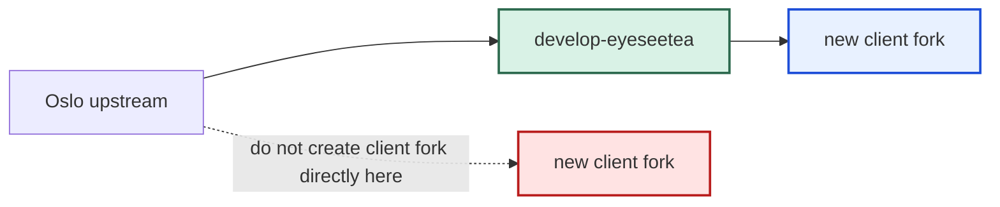
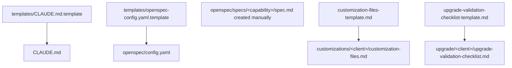
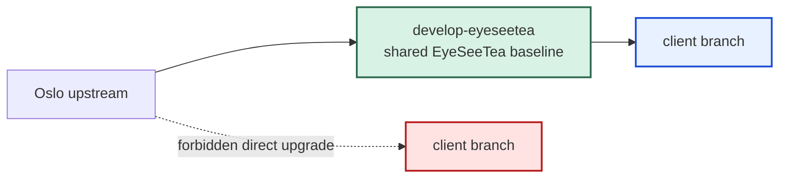
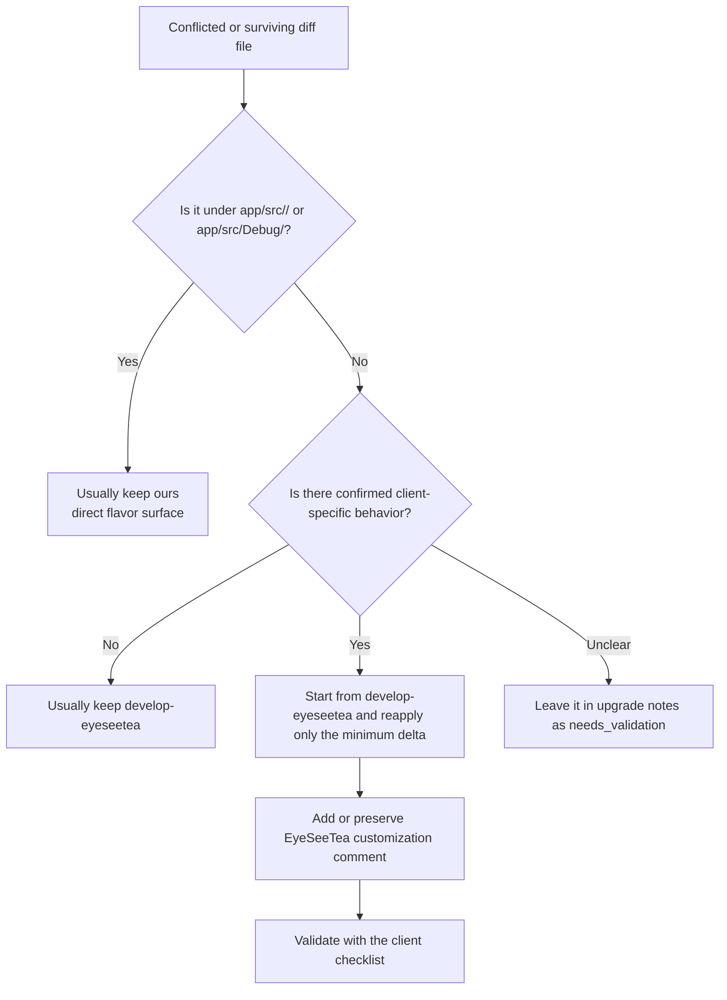
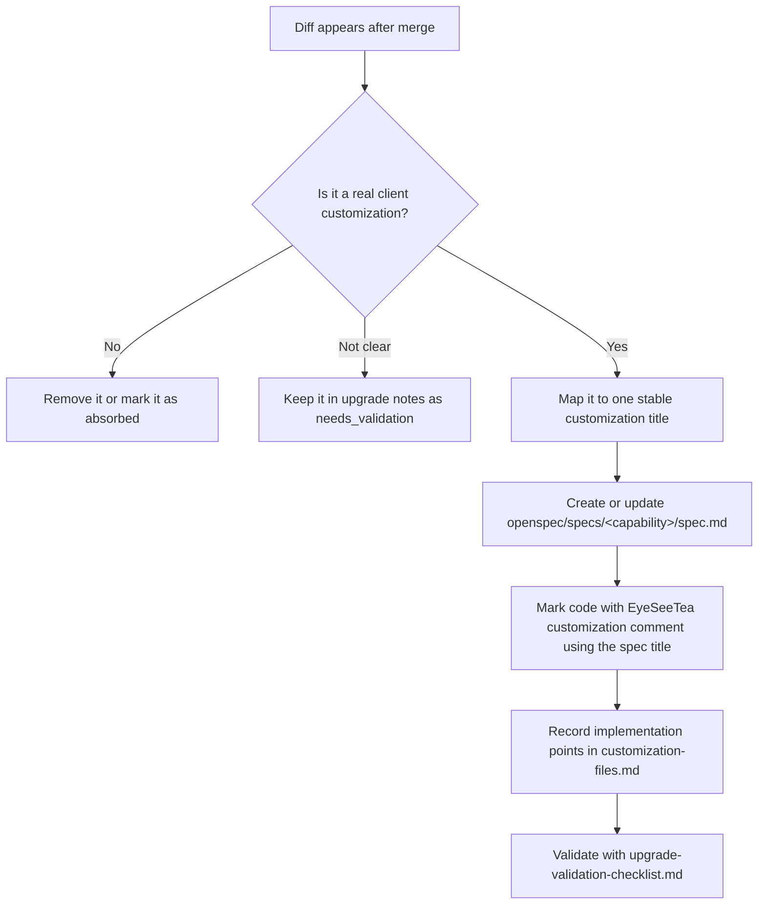
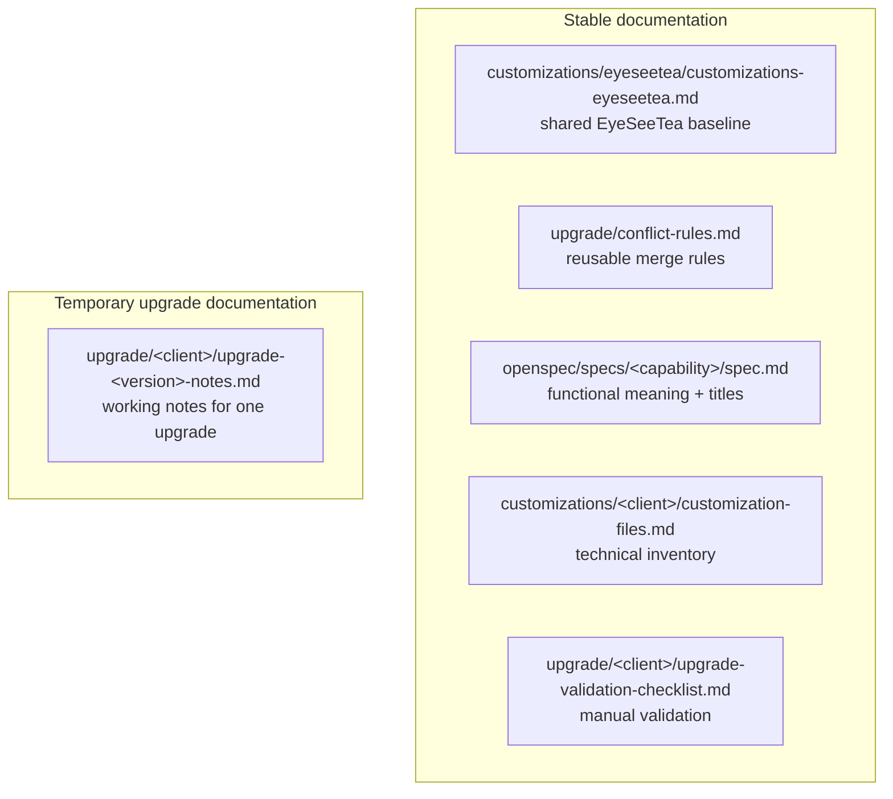

# EyeSeeTea Docs

This folder explains two workflows:
- how to create a new client fork from `develop-eyeseetea`
- how to upgrade an existing client fork without mixing shared baseline changes with client-specific logic

`develop-eyeseetea` is the shared EyeSeeTea baseline. Client forks live on top of that baseline.

## Who this README is for

- `Developer`
  Follows the manual workflow, creates or updates the client docs, reviews uncertain cases, and validates the final behavior.
- `AI agent`
  Assists with branch inspection, diff classification, low-risk conflict resolution, temporary notes, and upgrade bookkeeping under the documented rules.

## Golden rules

- never merge Oslo directly into a client branch
- always bring Oslo into `develop-eyeseetea` first
- do not treat every diff as a real client customization
- keep temporary upgrade progress in `upgrade-<version>-notes.md`, not in stable inventory files

## 1. New fork

### Goal

Create a new client fork from the shared EyeSeeTea baseline, set up the flavor identity, and create the minimum client documentation needed to maintain it over time.

### Shared rule

The new fork must start from `develop-eyeseetea`, not from Oslo.

### What the developer does

1. Create the new client branch from `develop-eyeseetea`. The Claude Code scaffolding (`.claude/commands/opsx/*`, `.claude/skills/openspec-*`, `.claude/settings.json`) is inherited automatically.
2. Define the client identity and flavor paths.
3. Install the OpenSpec CLI: `npm install -g @fission-ai/openspec@latest`. **Do not run `openspec init --tools claude`** — the `.claude/` scaffolding is already in baseline; running init would overwrite it. Just create empty `openspec/specs/` and `openspec/changes/` directories.
4. Copy the templates and fill in placeholders:
   - `templates/CLAUDE.md.template` → `CLAUDE.md` at repo root (project identity, customizations table)
   - `templates/openspec-config.yaml.template` → `openspec/config.yaml` (project context + per-artifact rules)
   - `customizations/template/customization-files-template.md` → `customizations/<client>/customization-files.md` (technical inventory)
   - `upgrade/template/upgrade-validation-checklist-template.md` → `upgrade/<client>/upgrade-validation-checklist.md` (manual QA flows)
5. Create one `openspec/specs/<capability>/spec.md` per customization, with SHALL/MUST requirements and WHEN/THEN scenarios.
6. Create the flavor surface in code and resources.
7. Build the first inventory of flavor files and shared customizations.
8. Mark shared surviving custom code with `// EyeSeeTea customization - [Title]` where `[Title]` is the top-level `# heading` of the matching OpenSpec spec.

### What the AI agent may help with

- inspect the diff against `develop-eyeseetea`
- list the direct flavor files and first shared diffs
- draft the first version of `customization-files.md`
- point out missing docs or obvious code-documentation mismatches

### What the AI agent must not do automatically

- invent functional customization titles without checking the intended client behavior
- treat raw shared diffs as confirmed customizations without review
- move shared EyeSeeTea baseline behavior into client-specific docs

### Expected result

When a new fork is correctly created:
- the branch baseline is `develop-eyeseetea`
- the flavor surface exists in `app/src/<flavor>/` and related directories
- functional customizations are described as OpenSpec specs under `openspec/specs/<capability>/spec.md`
- technical implementation points are tracked in `customization-files.md`
- manual validation flows are defined in `upgrade-validation-checklist.md`

Use this README to understand the model. For the full step-by-step checklist, read `eyeseetea-docs/new-fork.md`.

## 2. Upgrade existing client fork

### Goal

Upgrade a client fork safely by normalizing shared changes first in `develop-eyeseetea`, then reapplying only the minimum client-specific logic on top.

### Shared rule

`develop-eyeseetea` is always the EyeSeeTea upgrade baseline.

### Shared upgrade flow

1. Upgrade Oslo into `develop-eyeseetea`.
2. Resolve and validate shared EyeSeeTea changes there.
3. Merge `develop-eyeseetea` into the client branch.
4. Classify conflicts and surviving diff immediately after the merge.
5. Resolve easy conflicts using the reusable rules in `eyeseetea-docs/upgrade/conflict-rules.md`.
6. Reapply only the minimum client-specific logic in shared files.
7. Mark surviving shared customizations in code with the exact title from the matching OpenSpec spec (the `# heading` line of `openspec/specs/<capability>/spec.md`).
8. Validate each surviving customization.
9. Move only confirmed final customizations into `customization-files.md`.
10. Close the upgrade only when no unexplained shared drift remains.

### What the developer does

- decide when `develop-eyeseetea` is ready to be used as the new baseline
- review manual shared-code conflicts and unclear diffs
- confirm whether a surviving diff is a real business customization, absorbed behavior, or technical drift
- validate the client behavior after the merge
- decide when the upgrade can be closed

### What the AI agent may do automatically

The AI or agent can help with the mechanical part of the process:
- inspect branch state and diff against `develop-eyeseetea`
- classify files into direct flavor files, easy conflicts, manual conflicts, or `needs_validation`
- resolve obvious `ours` or `theirs` cases
- document temporary decisions in `upgrade-<version>-notes.md`
- keep the user informed at the end of each batch

### What the AI agent must not do automatically

- merge Oslo directly into the client branch
- assume every diff is a real customization
- rewrite shared files broadly when only a small delta is needed
- treat temporary notes as final stable documentation

### Conflict classification

`conflict-rules.md` is the reusable guide that tells the agent how to classify and resolve files. It is not the place for temporary progress.

### Lifecycle of a surviving customization

This is the main idea behind the upgrade process: a diff only becomes a customization when it has a stable title, a clear meaning, and validation.

### What gets written where during an upgrade

- `upgrade/<client>/upgrade-<version>-notes.md`
  Temporary progress, decisions, unresolved files, and validation status for the current upgrade.
- `customizations/<client>/customization-files.md`
  Final technical inventory of confirmed customizations that still survive on top of `develop-eyeseetea`.
- `openspec/specs/<capability>/spec.md`
  Stable functional source of truth: the human title (top-level `#` heading), lifecycle status, SHALL/MUST requirements, and WHEN/THEN scenarios.
- `upgrade/<client>/upgrade-validation-checklist.md`
  Manual validation flows for each surviving customization.

### When the developer should stop and review

Pause and review when:
- a shared file still differs but no clear customization title fits
- the customization seems technical rather than business-functional
- the clean diff after resolution is much larger than the expected delta
- a Java customization may now belong in a Kotlin replacement file

### Done criteria

An upgrade is only done when:
- every surviving customization has a stable title
- every surviving customization is documented in `customization-files.md`
- every surviving customization has validation coverage
- absorbed or removed customizations are marked accordingly
- unexplained shared drift is empty or explicitly tracked with a reason and next action

Use this README to understand the upgrade model. For the full step-by-step checklist, read `eyeseetea-docs/upgrade/upgrade-plan-client-forks.md`. Use `eyeseetea-docs/upgrade/conflict-rules.md` as the reusable decision guide during the merge.

## 3. Document roles

- `customizations/eyeseetea/customizations-eyeseetea.md`
  Source of truth for shared EyeSeeTea behavior in `develop-eyeseetea`.
- `upgrade/conflict-rules.md`
  Source of truth for reusable merge rules.
- `openspec/specs/<capability>/spec.md`
  Source of truth for client customization titles, functional intent, and normative requirements (SHALL/MUST + WHEN/THEN scenarios).
- `customizations/<client>/customization-files.md`
  Source of truth for the surviving technical customization inventory of a client.
- `upgrade/<client>/upgrade-validation-checklist.md`
  Source of truth for manual validation of a client.
- `upgrade/<client>/upgrade-<version>-notes.md`
  Temporary file for one upgrade only. Do not treat it as stable documentation.

> **Migration note (2026-04):** the `customizations/<client>/customization-specs.md` file is **no longer a stable artifact**. Its former role (functional titles + lifecycle status + expected behavior) now lives in `openspec/specs/`. It survives only as an **optional narrative draft during brownfield onboarding** (`onboarding-fork-guide.md` Phase 3): a cheap markdown place to dump and review customizations before installing OpenSpec. It is deleted at the end of Phase 4 once the content has been moved into OpenSpec specs. New greenfield forks can skip it entirely and go straight to creating `openspec/specs/<capability>/spec.md` files from the OpenSpec workflow. Existing forks that still carry a stable `customization-specs.md` should migrate during their next upgrade cycle.

## 4. Templates and support files

### Shared baseline and process

- `upgrade/upgrade-plan-client-forks.md`
  Main upgrade workflow for client forks.
- `upgrade/conflict-rules.md`
  Reusable merge rules and conflict strategy.
- `new-fork.md`
  Checklist for creating a new client fork for the first time.
- `customizations/eyeseetea/customizations-eyeseetea.md`
  Shared EyeSeeTea customizations that belong in `develop-eyeseetea`.
- `SDK_Setup.md`
  Shared SDK/setup documentation.

### Templates

- `templates/CLAUDE.md.template` — project identity for the fork (placement hierarchy, comment convention, automerge verification, post-merge check hierarchy already filled in)
- `templates/openspec-config.yaml.template` — OpenSpec project context + per-artifact rules (proposal/specs/design/tasks)
- `customizations/template/customization-files-template.md` — technical file inventory per customization
- `upgrade/template/upgrade-validation-checklist-template.md` — manual QA flow per customization
- `upgrade/template/upgrade-notes-template.md` — per-upgrade conflict log

Functional specs themselves are created manually under `openspec/specs/<capability>/spec.md` (one per customization), not from a markdown template — the OpenSpec CLI validates them.

### Support automation

- `scripts/check_upgrade_docs.py`
  Lightweight consistency checks for docs and customization titles.

Run it from the repository root with:
- `python3 eyeseetea-docs/scripts/check_upgrade_docs.py --client spocc`

## 5. Read this if...

### I want to understand the whole model

Read:
1. `README.md`
2. `upgrade/upgrade-plan-client-forks.md`
3. `upgrade/conflict-rules.md`

### I want to create a new client fork

Read:
1. `README.md`
2. `new-fork.md`
3. `customizations/eyeseetea/customizations-eyeseetea.md`

### I want to start or continue a client upgrade

Read:
1. `README.md`
2. `upgrade/upgrade-plan-client-forks.md`
3. `upgrade/conflict-rules.md`
4. `openspec/specs/` (all specs — functional reference for client customizations)
5. `upgrade/<client>/upgrade-validation-checklist.md`
6. `customizations/<client>/customization-files.md`
7. `upgrade/<client>/upgrade-<version>-notes.md` if the upgrade is already in progress

### I want to know whether something belongs in the baseline or in a client branch

Read:
1. `README.md`
2. `upgrade/upgrade-plan-client-forks.md`

## Promotion rule

- if a guide, rule, template, or automation helper no longer mentions a specific client and can be reused for any fork, move it to `develop-eyeseetea`
- if a document describes one client's behavior, validation, inventory, or temporary upgrade state, keep it in that client branch
